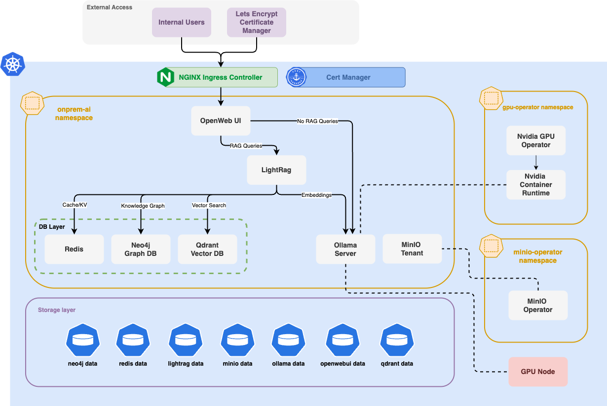

# OpenPrime AI - Production-Ready Helm Chart

[](#)
[](#)


## OpenPrime AI

If you’re currently using cloud-based AI services like ChatGPT or Microsoft Copilot, our on-premise open-source AI solution takes things to the next level — giving you complete control over your data and the ability to tailor the AI precisely to your company’s needs.

It runs directly on your own infrastructure — with no dependence on external vendors and zero monthly fees.

A modern AI solution built on open-source technologies, combining locally deployed LLM models (e.g., LLaMA, Mistral) with powerful search, experimentation, and model management capabilities.

A comprehensive Helm chart for deploying OpenPrime AI - a complete AI/ML platform featuring OpenWebUI, Ollama, LightRAG, and supporting services for production Kubernetes environments.

<p align="center">
  <a href="https://devopsgroup.eu/" title="DevOpsGroup page">
    <picture style="margin-right: 120px;">
      <source media="(prefers-color-scheme: dark)" srcset="devopsgroup-logo-db.png">
      <source media="(prefers-color-scheme: light)" srcset="devopsgroup-logo-wb.png">
      
    </picture>
  </a>
  <span>&nbsp;&nbsp;&nbsp;&nbsp;&nbsp;&nbsp;&nbsp;&nbsp;</span>
  <a href="https://dnation.cloud/" title="dNation page">
    <picture>
      <source media="(prefers-color-scheme: dark)" srcset="dnation-logo-db.png">
      <source media="(prefers-color-scheme: light)" srcset="dnation-logo-wb.png">
      
    </picture>
  </a>
</p>

## 🏗️ Architecture Overview



<br>

OpenPrime AI provides a complete AI platform stack including:

- **OpenWebUI**: Modern web interface for LLM interactions
- **Ollama**: High-performance LLM inference engine with optional GPU support
- **LightRAG**: Advanced Graph-based Retrieval-Augmented Generation system
- **Vector Database**: Qdrant for semantic search and embeddings
- **Graph Database**: Neo4j for knowledge relationships
- **Cache Layer**: Redis HA for high-performance caching
- **Object Storage**: MinIO for document and artifact storage

## 📋 Prerequisites

Before installing OpenPrime AI, ensure the following components are installed and configured in your cluster:

### Required Infrastructure

#### 1. NGINX Ingress Controller (or other ingress controller)
```bash
helm repo add ingress-nginx https://kubernetes.github.io/ingress-nginx
helm repo update
helm install ingress-nginx ingress-nginx/ingress-nginx \
  --namespace ingress-nginx \
  --create-namespace \
  --values dependencies/nginx-ingress-controller.yaml
```

#### 2. MinIO Operator (for object storage)
```bash
helm repo add minio-operator https://operator.min.io
helm repo update
helm install minio-operator minio-operator/operator \
  --namespace minio-operator \
  --create-namespace \
  --version 7.1.1 \
```

#### 3. GPU Operator (for GPU-enabled deployments)
Required for Ollama GPU acceleration on NVIDIA hardware:

```bash
helm repo add gpu-operator https://helm.ngc.nvidia.com/nvidia
helm repo update
helm install gpu-operator gpu-operator/gpu-operator \
  --namespace gpu-operator \
  --create-namespace \
  --version v25.3.4 \
  --values dependencies/nvidia-gpu-operator-values.yaml \
```

### Optional Components

#### Cert-Manager (recommended for production)
For automatic SSL certificate management:

```bash
helm repo add jetstack https://charts.jetstack.io
helm repo update
helm install cert-manager jetstack/cert-manager \
  --namespace cert-manager \
  --create-namespace \
  --values dependencies/cert-manager-values.yaml
```

Apply letsencrypt cluster issuer
```bash
kubectl apply -f dependencies/cert-manager-cluster-issuer.yaml
```

After installing cert-manager, create a ClusterIssuer:
```bash
kubectl apply -f examples/aks-example-with-gpu/cert-manager-cluster-issuer.yaml
```

## 🚀 Installation

### Quick Start (Local Development)
```bash
# Add the repository (if published)
helm repo add openprime-ai https://your-helm-repo.com/charts
helm repo update

# Install with default values
helm upgrade -i openprime-ai openprime-ai/openprime-ai \
  --namespace openprime-ai \
  --create-namespace
```

### Local Installation
```bash
# Clone the repository
git clone https://github.com/devopsgroupsk/openprime-ai.git
cd openprime-ai/core

# Update dependencies
helm dependency update

# Install the chart
helm upgrade -i openprime-ai . \
  --namespace openprime-ai \
  --create-namespace \
  --values values.yaml
```

### Production Installation (AKS with GPU)
```bash
helm upgrade -i openprime-ai . \
  --namespace openprime-ai \
  --create-namespace \
  --values examples/aks-example-with-gpu/aks-values.yaml
```

## ⚙️ Configuration

### Core Components Configuration

All components can be enabled/disabled via values:

```yaml
# Component toggles
open-webui:
  enabled: true
ollama:
  enabled: true
lightrag:
  enabled: true
redis-ha:
  enabled: true
qdrant:
  enabled: true
neo4j:
  enabled: true
tenant:  # MinIO tenant
  enabled: true
```

### GPU Configuration

For GPU-enabled deployments, ensure:

1. GPU Operator is installed (see prerequisites)
2. Configure GPU settings in values:

```yaml
ollama:
  enabled: true
  runtimeClassName: "nvidia-container-runtime"
  ollama:
    gpu:
      enabled: true
      type: "nvidia"
      number: 1
      nvidiaResource: nvidia.com/gpu
  tolerations:
    - key: "kubernetes.azure.com/scalesetpriority"
      operator: "Equal"
      value: "spot"
      effect: "NoSchedule"
```

### Domain and Ingress Configuration

Configure your domain and enable TLS:

```yaml
global:
  domain: "openprime.ai"

open-webui:
  ingress:
    enabled: true
    host: "openprime.ai"
    tls: true
    annotations:
      cert-manager.io/cluster-issuer: "letsencrypt"

ollama:
  ingress:
    enabled: true
    hosts:
      - host: "ollama.openprime.ai"
    tls:
      - secretName: ollama-openprime-ai
        hosts:
          - "ollama.openprime.ai"
```

## 📁 Examples

The `examples/` directory contains complete deployment configurations:

### AKS with GPU Example
- **Path**: `examples/aks-example-with-gpu/`
- **Features**: GPU support, production scaling, Azure-optimized
- **Values**: `aks-values.yaml`
- **Prerequisites**: All required manifests included

## 📊 Resource Requirements

### Minimum Requirements
- **CPU**: 4 cores
- **Memory**: 8Gi RAM
- **Storage**: 200Gi persistent storage
- **Kubernetes**: v1.25.0+

### Production Requirements
- **CPU**: 16+ cores (with GPU nodes)
- **Memory**: 32Gi+ RAM
- **Storage**: 1Ti+ persistent storage
- **GPU**: NVIDIA GPU (optional, for optimal performance)

---
