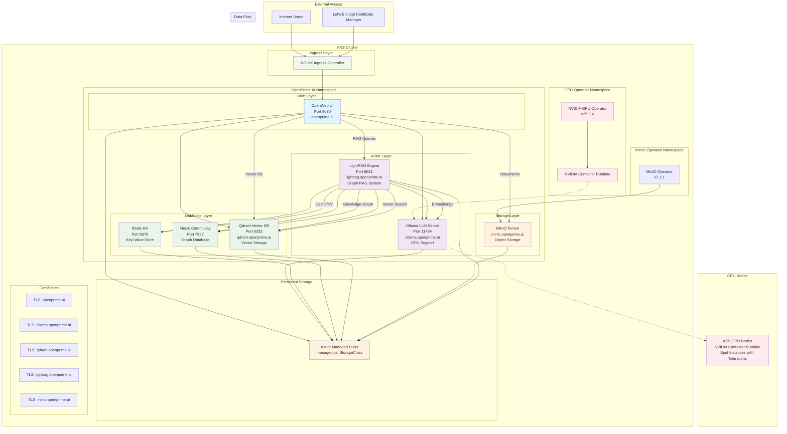

# AKS Example with GPU - OpenPrime AI Architecture

This example demonstrates the deployment of OpenPrime AI on Azure Kubernetes Service (AKS) with GPU support for optimal AI/ML workloads performance.

## Architecture Overview

The following Mermaid diagram illustrates the complete Kubernetes architecture deployed via Helmfile and Helm charts:

## Component Overview

### Core AI Components
- **OpenWeb UI**: Primary web interface for interacting with AI models
- **Ollama**: Large Language Model server with GPU acceleration
- **LightRAG**: Advanced Graph-based Retrieval-Augmented Generation system

### Database Layer
- **Redis HA**: High-availability key-value store for caching and session management
- **Neo4j**: Graph database for storing knowledge relationships
- **Qdrant**: Vector database for semantic search and embeddings

### Infrastructure Components
- **NVIDIA GPU Operator**: Manages GPU resources and container runtime
- **MinIO**: S3-compatible object storage for documents and artifacts
- **NGINX Ingress**: Load balancing and SSL termination

### Storage & Security
- **Azure Managed Disks**: Persistent storage with CSI driver
- **Let's Encrypt**: Automated SSL certificate management
- **Pod Security Contexts**: Non-root containers with minimal privileges

## Deployment Architecture

### Helmfile Deployment Order
1. **MinIO Operator** - Provides object storage capabilities
2. **GPU Operator** - Enables GPU support for AI workloads
3. **OpenPrime AI** - Main application stack (depends on operators)

### Network Communication
- Internal service-to-service communication via ClusterIP services
- External access through NGINX Ingress with TLS termination
- GPU workloads scheduled on nodes with NVIDIA container runtime

### Resource Management
- GPU resources allocated to Ollama for LLM inference
- Persistent volumes for model storage and database persistence
- Resource limits and requests configured for production workloads

This architecture provides a scalable, production-ready AI platform with GPU acceleration, comprehensive data storage, and secure external access.